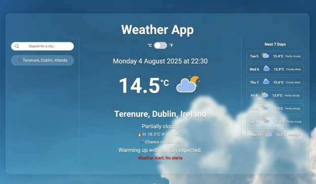

# 🌤️ Weather App

A responsive weather web app powered by the **Visual Crossing API**. Users can view the current weather based on **geolocation** or **city search**.

🔗 **Live Demo:** [hugolomba.github.io/weather-app](https://hugolomba.github.io/weather-app/)

## 🛠️ Technologies Used

- HTML5
- CSS3
- JavaScript (ES6)
- Visual Crossing Weather API

## 📘 Skills Demonstrated in This Project

- DOM manipulation and dynamic content creation
- Handling user events with `addEventListener`
- Using **event delegation** for dynamically added elements
- Conditional styling and **class switching** in JavaScript
- Form handling, validation, and user interaction
- Responsive layouts using **CSS Flexbox** and **media queries**
- Consuming and handling APIs with `fetch()` and parsing JSON
- Formatting dates and times based on **time zones**
- Using **CSS variables** and maintaining scalable styles
- Improving UX/UI with attention to structure, responsiveness, and interaction

## 🔑 Features

- **Automatic geolocation** weather display on page load
- **Search by city** with live weather data fetching
- **Local time** shown based on the selected city's timezone
- **Search history** saved below the input
  - Clickable items to reload weather data
  - Last searched location is highlighted automatically

## 🧭 How to Use

1. Allow location access when prompted.
2. Search for any city in the input field.
3. Click on previously searched cities or on your current location to reload data.
